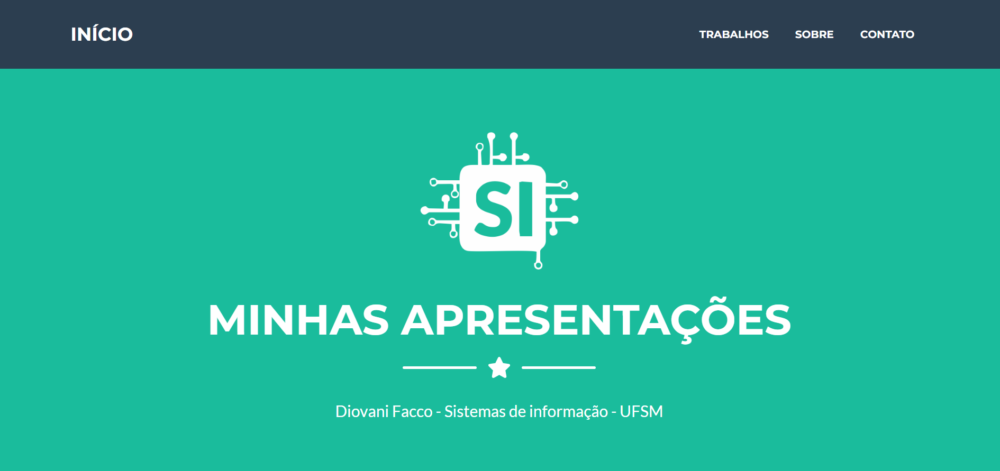

.

Acesso: (https://diovani-f.github.io/site_teste/)

#### Desenvolvedor(a)
Diovani Stefanello Facco

#### Cliente
Andrea Schwertner Charão

#### Tecnologias
- HTML
- CSS
- Template com Bootstrap
- FormSubmit (Terminal para formulário)

#### Ambiente de desenvolvimento

- VS Code
- Chrome

#### Créditos
- [URL de templates usados](https://startbootstrap.com/theme/freelancer)
- Créditos para a professora Andrea, que me auxiliou com o template e me deu dicas do que fazer, e como hospedar o site.

#### Bastidores

De início fiquei um pouco assustado com o projeto pois conheço pouco sobre programação web. Mas com o auxílio da professora,
e com a escolha do template pronto facilitou muito o trabalho. Com isso conseguir ir alterando a página, e alguns recursos que não conhecia
procurava tutoriais e vídeos no youtube, para aprender e entender o que estava fazendo. Mas acredito que seguindo o template consegui deixar 
o site todo funcional.

---
Projeto entregue para a disciplina de [Desenvolvimento de Software para a Web](http://github.com/andreainfufsm/elc1090-2023a) em 2023a
